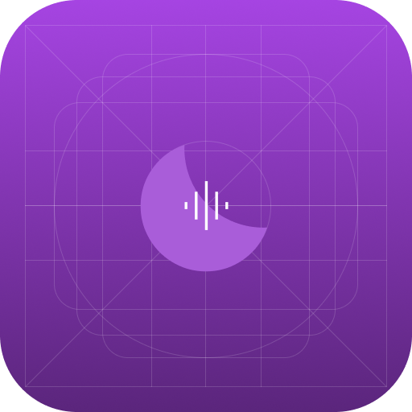

# VesperiOS Lunar
The audio-focused flavor of VesperiOS

## Tell me more, nerd
The idea of this flavor was born when me (an audiophile linux user) realized that there's no [free] Linux distros oriented towards Hi-Res audio playback. That's where something clicked inside my brain. I want this to achieve high-performance audio playback, enough to satisfy the few Linux audiophiles users like me, who are not willing to spend money on a Linux distro.

### Wait, would this be the opportunity for Spatial Audio on Linux?
HAHAHAHAHAHAHA no. I will asume you are talking about Dolby Atmos decoding support in Linux, and while it may be possible, I'm sure it's, pardon my french, hard as fuck, and I'm sure Dolby would be behind my ass if I dare to do that implementation without them charging me hundreds of dollars per installation. Not even macOS has proper Dolby Atmos decoding support (because of macOS lacking any way to play Dolby AC-4 IMS, the Dolby Atmos decoding support is limited to Dolby E-AC-3 JOC). It would not be an easy task to implement, not just the audio codecs and libraries, but an Spatial Audio renderer, even Windows struggles with that.
